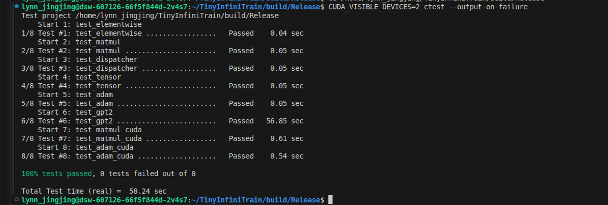

# TinyInfiniTrain 作业报告

## 一、test 通过截图

## 二、作业步骤

> 将代码填入下面代码块中指定位置，并详细描述完成该作业的解决思路和遇到的问题。

### 作业一：autograd机制调用Neg kernel的实现

难度：⭐

对应测例：`TEST(ElementwiseTest, NegForward)`，`TEST(ElementwiseTest, NegBackward)`

需要实现的代码块位置：`infini_train/src/autograd/elementwise.cc`

```c++
std::vector<std::shared_ptr<Tensor>> Neg::Forward(const std::vector<std::shared_ptr<Tensor>> &input_tensors) {
    // =================================== 作业 ===================================
    // TODO：通过Dispatcher获取设备专属kernel，对输入张量进行取反操作
    // HINT: 依赖test_dispatcher，kernel实现已给出
    // =================================== 作业 ===================================
}

std::vector<std::shared_ptr<Tensor>> Neg::Backward(const std::vector<std::shared_ptr<Tensor>> &grad_outputs) {
    // =================================== 作业 ===================================
    // TODO：通过Dispatcher获取设备专属的反向传播kernel，计算梯度
    // HINT: 依赖test_dispatcher，kernel实现已给出
    // =================================== 作业 ===================================
}
```

#### 解决思路

1. autograd：　自动微分中的Neg　
(1) Neg::forward ：仅输入有关, 参考Reciprocal::Forward风格
(2) Neg::backward：　与输入无关，仅与梯度有关，参考Reciprocal::Backward，　但是不用SetupContext
2. kernel：　与硬件平台有关
(1) 实现：已经实现，见cpu/elementwise.cc
std::shared_ptr<Tensor> NegForward(const std::shared_ptr<Tensor> &input) {
    return UnaryForward(input, [](float x) { return -x; });
}

std::shared_ptr<Tensor> NegBackward(const std::shared_ptr<Tensor> &grad_output) {
    return UnaryBackward(grad_output, nullptr, [](float) { return -1.0f; });
}
(2) 注册:　cpu/elementwise.cc中已完成注册，
#define REGISTER_CPU_ELEMENTWISE_KERNEL(kernel_name)                                                                   \
    REGISTER_KERNEL(infini_train::DeviceType::kCPU, kernel_name, infini_train::kernels::cpu::kernel_name)

REGISTER_CPU_ELEMENTWISE_KERNEL(NegForward)
REGISTER_CPU_ELEMENTWISE_KERNEL(NegBackward)
．．．
3. dispatch机制：解耦硬件平台device&kernel 和 计算autograd

4. 必要的安全性检查

#### 遇到问题


m
### 作业二：实现矩阵乘法

难度：⭐⭐

#### CPU实现

对应测例：`TEST(MatmulTest, BasicMatrixMultiply)`，`TEST(MatmulTest, BatchedMatrixMultiply)`, `TEST(MatmulTest, BackwardPass)`

需要实现的代码块位置：`infini_train/src/kernels/cpu/linear.cc`

```c++
    std::shared_ptr<Tensor> MatmulForward(const std::shared_ptr<Tensor> &input, const std::shared_ptr<Tensor> &other) {
        // =================================== 作业 ===================================
        // TODO：实现CPU上的矩阵乘法前向计算
        // REF:
        // =================================== 作业 ===================================

    }

    std::tuple<std::shared_ptr<Tensor>, std::shared_ptr<Tensor>>
        MatmulBackward(const std::shared_ptr<Tensor> &input, const std::shared_ptr<Tensor> &other,
                    const std::shared_ptr<Tensor> &grad_output) {
        // =================================== 作业 ===================================
        // TODO：实现CPU上的矩阵乘法反向传播
        // REF:
        // =================================== 作业 ===================================
    }
```

#### CUDA实现

对应测例：`TEST(MatmulTest, BasicMatrixMultiplyCuda)`,`TEST(MatmulTest, BatchedMatrixMultiplyCuda)`,`TEST(MatmulTest, BackwardPassCuda)`

需要实现的代码块位置：`infini_train/src/kernels/cuda/linear.cu`

```c++
    std::shared_ptr<Tensor> MatmulForward(const std::shared_ptr<Tensor> &input, const std::shared_ptr<Tensor> &other) {
        // =================================== 作业 ===================================
        // TODO：实现CUDA上的矩阵乘法前向计算
        // REF:
        // =================================== 作业 ===================================
    }

    std::tuple<std::shared_ptr<Tensor>, std::shared_ptr<Tensor>>
        MatmulBackward(const std::shared_ptr<Tensor> &input, const std::shared_ptr<Tensor> &other,
                    const std::shared_ptr<Tensor> &grad_output) {
        // =================================== 作业 ===================================
        // TODO：实现CUDA上的矩阵乘法反向传播
        // REF:
        // =================================== 作业 ===================================
    }
```

#### 解决思路
Forward
-批量矩阵乘法: C = A @ B
-其中 A 的形状为 [..., M, K]，B 的形状为 [..., K, N]，输出 C 的形状为 [..., M, N]
CPU
1. 输入验证：检查张量非空、数据类型为 float32、设备为 CPU
2. 维度检查：确保输入至少是 2D，且内维度匹配（A 的列数 = B 的行数）
3. 批次处理：
4. 核心计算：
- 使用 Eigen 库进行高效矩阵乘法
- 对每个 batch，将数据映射为 Eigen::Matrix（RowMajor 行主序）
- 执行 C = A * B
5. 广播处理：
- 若 input_batch=1，则 input_stride=0，所有 batch 共用同一个 A
- 若 other_batch=1，则 other_stride=0，所有 batch 共用同一个 B

GPU

1. 输入验证：检查张量非空、数据类型为 float32、设备为 CUDA
2. 维度检查：确保输入至少是 2D，且内维度匹配（A 的列数 = B 的行数）
3. 计算 batch_size，支持广播（一方 batch=1 时可与任意 batch 相乘）
4. 创建 cuBLAS handle
5. 根据 batch_size 选择：
- batch_size == 1: 使用 cublasSgemm（2D 矩阵乘法）
- batch_size > 1:  使用 cublasSgemmStridedBatched（批量矩阵乘法）
6. 广播处理：stride=0 表示该输入在所有 batch 上共享同一数据
7. 销毁 cuBLAS handle，返回结果

Backward
-前向: C = A @ B，其中 A[..., M, K]，B[..., K, N]，C[..., M, N]
-反向传播（链式法则）:
--∂L/∂A = ∂L/∂C @ B^T    即 dA[M,K] = dC[M,N] @ B^T[N,K]
--∂L/∂B = A^T @ ∂L/∂C    即 dB[K,N] = A^T[K,M] @ dC[M,N]

CPU 
1. 输入验证：同前向，检查所有张量的类型和设备
2. 维度提取：获取 M, K, N 以及各自的 batch_size
3. 创建梯度张量：grad_input 与 input 同形状，grad_other 与 other 同形状
4. 广播梯度累加：
5. 使用 Eigen 高效实现矩阵乘法和转置

GPU
1. cuBLAS 行主序处理 - grad_input 计算
2. cuBLAS 行主序处理 - grad_other 计算
3. 广播梯度累加


#### 遇到问题
1. 广播


### 作业三：实现Adam优化器

难度：⭐

#### CPU实现

对应测例：`TEST(AdamOptimizerTest, BasicParameterUpdate)`,`TEST(AdamOptimizerTest, MomentumAccumulation)`

代码位置：infini_train/src/kernels/cpu/accumulate_grad.cc

```c++
void AdamAccumulateGrad(const std::shared_ptr<Tensor> &grad, const std::shared_ptr<Tensor> &param,
                        const std::shared_ptr<Tensor> &m, const std::shared_ptr<Tensor> &v, float learning_rate,
                        float beta1, float beta2, float eps, int64_t t) {
    // =================================== 作业 ===================================
    // TODO：实现Adam优化器的梯度累积和参数更新
    // REF: 
    // =================================== 作业 ===================================
}
```

#### CUDA实现

对应测例：`TEST(AdamOptimizerTest, BasicParameterUpdateCuda)`,`TEST(AdamOptimizerTest, MomentumAccumulationCuda)`

代码位置：infini_train/src/kernels/cuda/accumulate_grad.cu

```c++
void AdamAccumulateGrad(const std::shared_ptr<Tensor> &grad, const std::shared_ptr<Tensor> &param,
                        const std::shared_ptr<Tensor> &m, const std::shared_ptr<Tensor> &v, float learning_rate,
                        float beta1, float beta2, float eps, int64_t t) {
    // =================================== 作业 ===================================
    // TODO：实现Adam优化器的梯度累积和参数更新
    // REF: 
    // =================================== 作业 ===================================
}
```

#### 解决思路
    // 对于每个参数 θ 和其梯度 g，在第 t 步：
    //
    //   m_t = β₁ · m_{t-1} + (1 - β₁) · g_t          // 更新一阶矩估计
    //   v_t = β₂ · v_{t-1} + (1 - β₂) · g_t²         // 更新二阶矩估计
    //   m̂_t = m_t / (1 - β₁^t)                       // 偏差修正（一阶矩）
    //   v̂_t = v_t / (1 - β₂^t)                       // 偏差修正（二阶矩）
    //   θ_t = θ_{t-1} - lr · m̂_t / (√v̂_t + ε)       // 参数更新
CPU
1. 获取数据指针和元素数量
2. 预计算偏差修正系数：bc1 = 1 - β₁^t，bc2 = 1 - β₂^t
3. 对每个元素执行 Adam 更新：
- 更新一阶矩：m = β₁·m + (1-β₁)·g
- 更新二阶矩：v = β₂·v + (1-β₂)·g²
- 计算偏差修正后的矩估计
- 更新参数：θ -= lr · m̂ / (√v̂ + ε)

CUDA
AdamAccumulateGradKernel()
每个 CUDA 线程处理一个参数元素，实现高度并行化。
偏差修正系数在 Host 端预计算后传入，避免每个线程重复计算 pow()。
1. 并行化：每个元素由独立的 CUDA 线程处理
2. 预计算优化：偏差修正系数 (1-β^t) 在 Host 端计算一次，传给所有线程
- 避免每个线程调用 powf()（GPU 上 pow 计算开销大）
3. 内存访问：使用寄存器暂存中间结果，减少全局内存读写次数
4. threads_per_block = 256：常用配置，平衡占用率和寄存器压力
    num_blocks = ceil(n / 256)：确保覆盖所有元素

#### 遇到问题


### 作业四：实现Tensor基础操作

#### 实现Tensor的Flatten操作

难度：⭐

对应测例：`TEST(TensorTransformTest, Flatten2DTo1D)`,`TEST(TensorTransformTest, FlattenWithRange) `,`TEST(TensorTransformTest, FlattenNonContiguous)`

代码位置：infini_train/src/tensor.cc

```c++
std::shared_ptr<Tensor> Tensor::Flatten(int64_t start, int64_t end) {
    // =================================== 作业 ===================================
    // TODO：实现张量扁平化操作，将指定维度范围[start, end]内的所有维度合并为一个维度
    // HINT: 
    // =================================== 作业 ===================================
}
```

#### 实现Tensor的反向传播机制

难度：⭐

对应测例：`TEST(TensorAutogradTest, BackwardComputesGradient)`,`TEST(TensorAutogradTest, BackwardWithMultipleOutputs)`

代码位置：infini_train/src/tensor.cc

```c++
void Tensor::Backward(std::shared_ptr<Tensor> gradient, bool retain_graph, bool create_graph) const {
    // =================================== 作业 ===================================
    // TODO：实现自动微分反向传播
    // 功能描述：1. 计算当前张量对叶子节点的梯度    2. 支持多输出场景的梯度累加
    // HINT: 
    // =================================== 作业 ===================================
}
```

#### 解决思路
1. 边界情况：空张量直接返回
2. 负索引支持：
3. 合法性检查：
4. 计算合并后的维度大小：
    merged = dims_[start] * dims_[start+1] * ... * dims_[end]
5. 构造新形状：
6. 调用 Contiguous()->View(new_shape)：
 - Contiguous() 确保内存连续（Transpose 等操作后内存可能不连续）
 - View() 在不复制数据的情况下改变形状（要求内存连续）

1. 叶子节点 (is_leaf_ == true)：用户创建的张量（如模型参数），梯度累加到 grad_ 成员
2. 非叶子节点：由运算产生的中间结果，持有 grad_fn_ 指向创建它的 Function
3. grad_fn_：指向创建该张量的 autograd::Function，负责计算反向传播
4. output_idx_：当 Function 有多个输出时，标识当前张量是第几个输出

#### 遇到问题
1. 梯度累加必须使用 += 而非 =


### 作业五 注册算子kernel的实现

难度：⭐⭐⭐

对应测例：`TEST(DispatcherTest, RegisterAndGetKernel)`,`TEST(DispatcherTest, DuplicateRegistration)`,`TEST(DispatcherTest, GetNonexistentKernel)`

代码位置：infini_train/include/dispatcher.h

```c++
template <typename RetT, class... ArgsT> RetT Call(ArgsT... args) const {
    // =================================== 作业 ===================================
    // TODO：实现通用kernel调用接口
    // 功能描述：将存储的函数指针转换为指定类型并调用
    // HINT: 
    // =================================== 作业 ===================================
}

template <typename FuncT> void Register(const KeyT &key, FuncT &&kernel) {
    // =================================== 作业 ===================================
    // TODO：实现kernel注册机制
    // 功能描述：将kernel函数与设备类型、名称绑定
    // =================================== 作业 ===================================
}

#define REGISTER_KERNEL(device, kernel_name, kernel_func) \
    // =================================== 作业 ===================================
    // TODO：实现自动注册宏
    // 功能描述：在全局静态区注册kernel，避免显式初始化代码
    // =================================== 作业 ===================================
```

#### 解决思路
1. 调用：不同类型的指针
(1) 存储时：　构造函数实现，将函数指针转为统一的void*
(2) 调用时：从统一的void* 还原为原来的函数指针类型
    RetT = std::shared_ptr<Tensor>
    ArgsT... = const std::shared_ptr<Tensor>&
    FuncT = std::shared_ptr<Tensor> (*)(const std::shared_ptr<Tensor>&)

2. 注册：
(1) 设备类型和名称：
using KeyT = std::pair<DeviceType, std::string>;
(2)　统一类型：
KernelFunction（）：将 kernel 转为 void* 存储
(3) 存入map: std::map<KeyT, KernelFunction> key_to_kernel_map_
std::forward 的作用:保持 kernel 的原始类型（左值/右值）
emplace: 原地构造 KernelFunction，避免拷贝

3. 自动注册宏：　静态调用链条
(1) 第一层：连接辅助宏，强制 __LINE__ 展开
#define REGISTER_KERNEL_CONCAT(device, kernel_name, kernel_func, line)
(2) 第二层：展开 __LINE__
#define REGISTER_KERNEL_EXPAND(device, kernel_name, kernel_func, line) 
(3) 第三层：用户接口
#define REGISTER_KERNEL(device, kernel_name, kernel_func)


#### 遇到问题

自动注册宏，由于device中含有：：，　会转换成＃＃，　需要使用三级展开

### 作业六：实现GPT-2整体训练

难度：⭐⭐⭐⭐

对应测例：`TEST_F(GPT2TrainingTest, LogitsConsistency)`

#### 训练过程logits对比

完成以上所有作业，补齐训练框架的所有实现，理论上`TEST_F(GPT2TrainingTest, LogitsConsistency)`可以通过，在用例中判断比较预置的值和单步正向传播计算结果是否在误差允许范围内相等。

#### 数据读取实现

代码位置：example/common/tiny_shakespeare_dataset.cc

```c++
TinyShakespeareFile ReadTinyShakespeareFile(const std::string &path, size_t sequence_length) {
    /* =================================== 作业 ===================================
       TODO：实现二进制数据集文件解析
       文件格式说明：
    ----------------------------------------------------------------------------------
    | HEADER (1024 bytes)                     | DATA (tokens)                        |
    | magic(4B) | version(4B) | num_toks(4B) | reserved(1012B) | token数据           |
    ----------------------------------------------------------------------------------
       =================================== 作业 =================================== */
}

TinyShakespeareDataset::TinyShakespeareDataset(const std::string &filepath, size_t sequence_length) {
    // =================================== 作业 ===================================
    // TODO：初始化数据集实例
    // HINT: 调用ReadTinyShakespeareFile加载数据文件
    // =================================== 作业 ===================================
}
```

#### Tokenizer功能实现

代码位置：example/common/tokenizer.cc

```c++
Tokenizer::Tokenizer(const std::string &filepath) {
    /* ===================================== 作业 =====================================
    TODO：实现Tokenizer二进制文件加载

    文件格式说明：
    ----------------------------------------------------------------------------------
    | HEADER (1024 bytes)                     | VOCAB TABLE                           |
    | magic(4B) | version(4B) | vocab_size(4B) | reserved(1012B) | token词表数据       |
    ----------------------------------------------------------------------------------
    ===================================== 作业 ===================================== */
}
```

```c++
std::string Tokenizer::Decode(uint32_t token_id) const {
    /* ===================================== 作业 =====================================
    TODO：实现token_id到文本的转换
    功能描述：根据token_id返回对应的文本片段
    ===================================== 作业 ===================================== */
}
```

```c++
void Tokenizer::GenerateText(infini_train::nn::Module &model, uint32_t batch_size, uint32_t sequence_length,
                             uint32_t text_length, Device device) const {
    /* ...原代码... */
    LOG(INFO) << "start generate text:";
    for (int t = prompt_len; t < text_length; t++) {
        /* ===================================== 作业 =====================================
        TODO：实现单步文本生成逻辑
        HINT：调用model.Forward推理获取logits，根据推理结果进行随机采样，调用Decode获取文本结果
        ===================================== 作业 ===================================== */
    }
    std::cout << std::endl;
}
```

#### 解决思路
1. 数据集加载
打开二进制文件，根据协议解析字段，　根据magic 确定token类型，读取所有token数据，转换为int64_t．返回TinyShakespeareFile.
(1)加载 .bin 文件 → Tensor (num_samples, seq_len) 
(2) operator[] 返回 (x, y) 对，y = x 偏移 1 个 token 
2. Tokenizer功能实现
(1)Tokenizer：读取 header，根据协议解析字段，循环读取每个 token，存入 token_table_
(2)Decode：return token_table_[token_id]
3. GPT2 Model 
for each position t:
    1. Forward: logits = model.Forward(x)     // (bs, seq_len, vocab)
    2. 取位置 t-1 的 logits
    3. Softmax: 将 logits 转为概率分布
    4. 采样: next_token = SampleMult(probs, random)
    5. 更新: x[t] = next_token
    6. 输出: print(Decode(next_token))


#### 遇到问题
1. 构造函数的成员变量是const, 必须用初始化列表
2. Tokenizer 用 int32 读长度，实际是 uint8 
3. 分配资源
